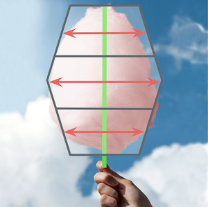
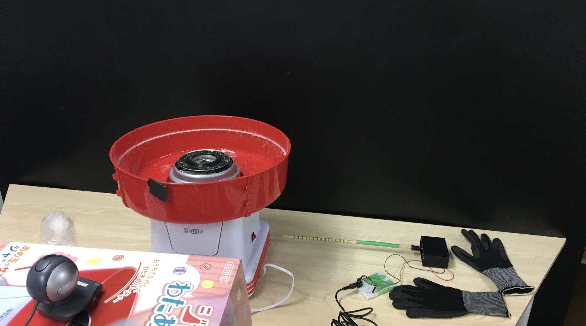

# 最適化わたあめ
わたあめを最適な形状にするためにリアルタイムで巻き取る方向を支持してくれるアプリケーション

## Website
https://kemako.github.io/wataame_detector/

## 実際の様子
- 下の画像をクリックするとYoutubeで動画を再生できます

## 最適なわたあめとは？
- わたあめの最適な形状を数学的に定義
- 上端、下端に比べて中央が膨らんでいる形状を最適な形状とする

### 最適なわたあめの数学的な定義
- 最適な形状を分散を用いることで数学的に定義した
- ここでは、軸からわたあめの白い部分の分散を比較し、上端、下端に比べて中央の分散が大きいものが最適であると定義した

## 準備
### 必要なもの
- わたあめ機
- Webカメラ
- モーター
- 菜箸
- 養生テープ
- 黒い軍手
- カップリング
- ACアダプタ
- ザラメ

### 使用環境
- 照明を暗くした部屋
- わたあめにだけライトを当てる

## 実装内容
### 軸の検出
- 軸(菜箸)に養生テープをまく
- 養生テープの緑色をHSVの範囲を指定することで位置を検出
### 画像の回転
- 検出した軸に直線をフィッテングさせる
- フィッティングさせた直線の傾きを計算し、画像を回転
### わたあめの検出
- わたあめの白色をHSVの範囲を指定することで位置を検出
### 分散の計算
- 検出した軸の位置とわたあめの位置から分散を計算
- この時わたあめの上部・中央部・下部に分けて分散を計算
### 指示
- 上中下の分散を比較し、巻き取るべき方向を算出
- up/down/wakannyaiの3種類で表示

## わかったこと
- CSVだけでわたあめを検出するのは厳しい
- 照明条件が厳しすぎる
  - 背景が光を反射して白く光るとわたあめと検出されてしまう
